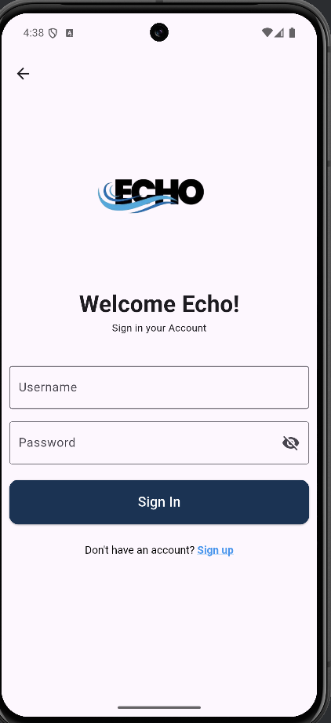
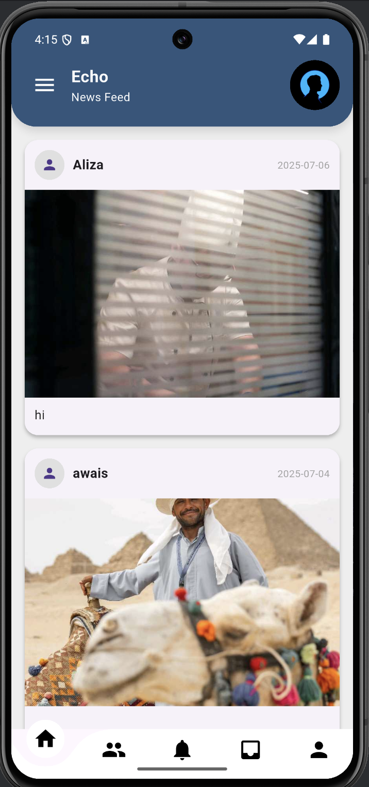
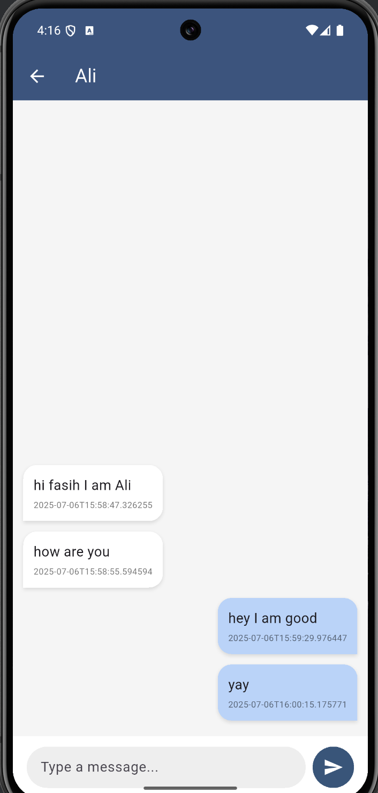
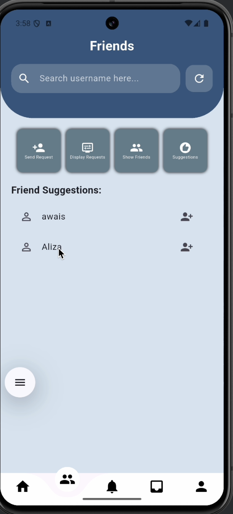
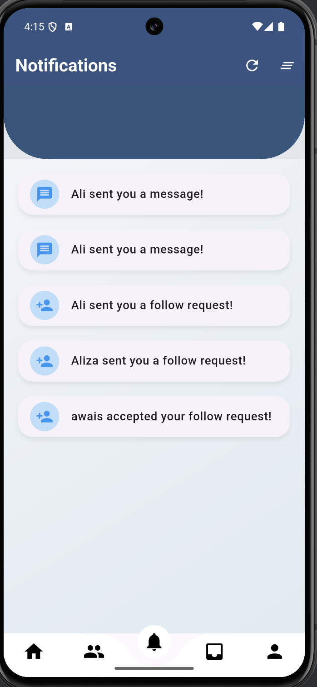

# Echo - A Social Communication Platform

> **Echo is a GUI-based Flutter social application meticulously engineered as my 4th semester Data Structures and Algorithms (DSA) project.**

## Project Goal

The primary objective of the Echo project was to **gain a strong practical understanding of how to implement and integrate fundamental Data Structures and Algorithms (DSA) in a real-world, interactive application.** This project serves as a comprehensive demonstration of how DSA concepts are crucial for building scalable, efficient, and feature-rich systems in software development. Through a **robust and object-oriented design**, Echo also emphasizes how a well-structured project can **facilitate easy implementation of new features and future scalability.**

## About the Application

Echo provides a rich set of social features designed to mimic modern social networking interactions. It offers robust one-to-one chat capabilities, a dynamic news feed, comprehensive friend request management, and intelligent friend suggestions. All these functionalities are powered by an extensive implementation and integration of core data structures and algorithms, showcasing their practical application within a user-friendly and interactive GUI.

## Key Highlights

* **Deep DSA Integration**: A practical demonstration of how core data structures and algorithms form the backbone of modern social applications, designed from a low-level system design perspective.

* **Robust & Modular Design**: Built with a focus on **Object-Oriented Programming (OOP) principles** and a clear MVC architecture, ensuring the project is highly maintainable, extensible, and allows for **easy implementation of new features**.

* **User-Centric Features**: Efficient user registration, authentication, and profile management for a seamless user experience.

* **Dynamic Social Interaction**: Features for posting, message exchange, and managing friend connections to foster community.

* **Smart Social Features**: Friend suggestions powered by graph algorithms, and a news feed optimized for relevance and timely content delivery.

## Core Features

### User Management & Profile

* **User Registration & Login**: Secure authentication for new and existing users.

* **User Profiles**: Manage personal information and display posts.

### Communication & Interaction

* **One-to-One Chat**: Exchange messages between friends using a responsive messaging interface.

* **Friend Requests**: Send, accept, or decline connection requests.

* **Friend Connections**: Establish and manage connections between users (adding/accepting friendships).

* **News Feed**: A dynamic feed displaying posts from connected friends.

* **Notifications**: In-app alerts for new messages, friend requests, and accepted connections.

* **Posting**: Create and share image-based posts with captions.

### Smart Social Features

* **Friend Suggestions**: Discover potential connections based on your existing friend network.

* **Dynamic News Feed**: Posts are organized to show the most recent and relevant content first.

## 📸 App Screenshots

A quick preview of Echo’s key features in action:

---

### 🔐 Login & Registration

<table>
  <tr>
    <td align="center">
      <br/>
      <sub><b>Login</b></sub>
    </td>
    <td style="width: 30px;"></td>
    <td align="center">
      <br/>
      <sub><b>Register</b></sub>
    </td>
  </tr>
</table>

---

### 📝 Add Post / 📰 News Feed

<table>
  <tr>
    <td align="center">
      <br/>
      <sub><b>Add Post</b></sub>
    </td>
    <td style="width: 30px;"></td>
    <td align="center">
      <br/>
      <sub><b>News Feed</b></sub>
    </td>
  </tr>
</table>

---

### 💬 Messages / 🧵 Chat List

<table>
  <tr>
    <td align="center">
      <br/>
      <sub><b>Messages</b></sub>
    </td>
    <td style="width: 30px;"></td>
    <td align="center">
      <br/>
      <sub><b>Chat</b></sub>
    </td>
  </tr>
</table>

---

### 🤝 Friend Connections (Requests, Friends, Suggestions)

<table>
  <tr>
    <td align="center">
      <br/>
      <sub><b>Friend Requests</b></sub>
    </td>
    <td style="width: 20px;"></td>
    <td align="center">
      <br/>
      <sub><b>Friends List</b></sub>
    </td>
    <td style="width: 20px;"></td>
    <td align="center">
      <br/>
      <sub><b>Suggestions</b></sub>
    </td>
  </tr>
</table>

---

### 🔔 Notifications

<table>
  <tr>
    <td align="center">
      <br/>
      <sub><b>Notifications</b></sub>
    </td>
  </tr>
</table>


## Educational Purpose

This project was developed with a strong focus on applying theoretical Data Structures and Algorithms concepts to a practical, full-stack application. It aims to demonstrate:

* The **real-world utility** and performance implications of various data structures.

* **System design principles** for building complex applications using DSA as core components.

* The process of **integrating custom DSA implementations** with a modern framework (Flutter) and backend (Firebase).

* Best practices in **Object-Oriented Programming (OOP)** and architectural patterns like **MVC**.

## Data Structures & Algorithms in Action

This project is a direct application of various data structures and algorithms to solve real-world social network challenges:

| Data Structure / Algorithm | Application |
| :------------------------- | :------------------------------------------------------------------------------------------------------------------------------------------------------------------------------------------------------------------------------------------------------------------------------------------------------ |
| **AVL Tree** | Implemented for efficient **user management** and **lookup**. User profiles are stored in the AVL Tree, allowing for quick `O(log N)` search, insertion, and retrieval operations by username, ensuring scalability for a growing user base. |
| **Graph (Adjacency Matrix) & BFS**| A dynamically sized **List of Lists (Adjacency Matrix)** represents the entire **friend network**. This graph is used to manage and establish friendships and, critically, to implement **friend suggestions** using a **Breadth-First Search (BFS)** algorithm. BFS efficiently finds "friends of friends" (level 2 connections) to suggest new connections. |
| **Linked List** | **Chat History**: `MessageNode`s form a Linked List to store individual messages within each one-to-one conversation. <br/> **Chat List**: `ChatNode`s form a Linked List to efficiently manage and access all active conversations for a user. <br/> **Internal Structures**: Also used internally for `PostStack`, `NotificationStack`, and `RequestQueue` nodes. |
| **Stack (LIFO)** | **User Posts**: `PostStack` maintains a user's recent posts in a Last-In, First-Out manner. <br/> **Notifications**: `NotificationStack` manages in-app notifications, ensuring new alerts are readily accessible. |
| **Queue (FIFO)** | `RequestQueue` manages incoming **friend requests** in a First-In, First-Out (FIFO) order, ensuring requests are processed equitably based on arrival time. |
| **Heap (Priority Queue)** | `NewsFeedHeap` is implemented as a **Max-Heap** (ordered by date) to manage the **news feed**. This allows the application to efficiently retrieve and display posts from friends in chronological order (newest first). |

## Tech Stack

Echo is built using the following core technologies and architectural patterns:

* **Frontend**: Flutter (Dart) for a cross-platform GUI, utilizing GetX for state management.
* **Backend & Persistence**: Firebase Firestore for scalable data storage and user authentication.
* **Core Data Structures**: Custom-built implementations of various ADTs including **AVL Tree**, **Graph (Adjacency Matrix)**, **Linked List**, **Stack**, **Queue**, and **Heap (Priority Queue)**, which are central to the application's logic and performance.

### Project Structure

```
Echo/
├── android/                            # Android-specific project files and configurations
├── assets/                             # Application assets
│   └── images/                         # Image assets
├── lib/                                # Dart source code
│   ├── component/                      # Reusable UI widgets and common Flutter components
│   │   ├── MyDrawer.dart               # Custom navigation drawer
│   │   ├── MyTextBox.dart              # Custom text input field
│   │   ├── bottomNavbar.dart           # Bottom navigation bar implementation
│   │   ├── button_container.dart       # Reusable button container widget
│   │   ├── myListTile.dart             # Custom list tile widget
│   │   └── route.dart                  # Application routing definitions
│   ├── constant/                       # Constant values and utility functions
│   │   └── post_card_builder.dart      # Widget builder for displaying post cards
│   ├── controllers/                    # GetX controllers for managing application logic and state (MVC)
│   │   ├── friends_connections.dart    # Manages friend requests, connections, and suggestions
│   │   ├── message.dart                # Handles one-to-one chat logic and message persistence
│   │   ├── newsfeed.dart               # Manages news feed data, loading, and display logic
│   │   ├── notifications.dart          # Manages in-app notifications and their state
│   │   ├── posts.dart                  # Handles post creation, image uploads, and post deletion
│   │   ├── profile.dart                # Manages user profile data, image, and bio updates
│   │   └── register_login.dart         # User authentication (registration and login)
│   ├── models/                         # Custom Data Structure implementations and data models
│   │   ├── bst.dart                    # AVL Tree (BST) implementation for efficient user lookup
│   │   ├── echo.dart                   # Central hub for global state, graph connections, and active user
│   │   ├── friendlisQueue.dart         # Queue implementation for managing pending friend requests
│   │   ├── messageLL.dart              # Linked List implementation for chat messages and chat lists
│   │   ├── newsfeedheap.dart           # Heap (Priority Queue) implementation for sorting news feed posts
│   │   ├── notificationStack.dart      # Stack implementation for managing notifications
│   │   ├── postStack.dart              # Stack implementation for managing user's posts
│   │   └── userService.dart            # User data model, integrates various data structures
│   ├── onboarding_screen/              # Introduction/Onboarding screens for new users
│   │   ├── IntroScreen1.dart           # First onboarding screen
│   │   ├── introScreen2.dart           # Second onboarding screen
│   │   ├── introScreen3.dart           # Third onboarding screen
│   │   └── onboarding_screen.dart      # Main onboarding flow manager
│   ├── Screen/                         # UI Screens/Pages of the application
│   │   ├── LoginScreen.dart            # User login interface
│   │   ├── chatdetailscreen.dart       # Detailed one-to-one chat view
│   │   ├── friendscreen.dart           # Friend management screen (requests, friends, suggestions)
│   │   ├── messagescreen.dart          # List of user chats and message initiation
│   │   ├── newsfeedscreen.dart         # Main news feed display
│   │   ├── notificationsscreen.dart    # Notifications display screen
│   │   ├── post_screen.dart            # Screen for creating and viewing posts
│   │   ├── profileScreen.dart          # User profile view and edit interface
│   │   └── registerScreen.dart         # User registration interface
│   ├── firebase_options.dart           # Firebase configuration generated by FlutterFire
│   └── main.dart                       # Main application entry point
├── .gitignore                          # Files/directories to ignore by Git
├── .metadata                           # Flutter metadata
├── analysis_options.yaml               # Dart linter rules
├── firebase.json                       # Firebase project configuration (CLI)
├── pubspec.lock                        # Flutter package lock file
├── pubspec.yaml                        # Flutter project dependencies and metadata
└── README.md                           # Project documentation
```

## Quick Start Guide

To get Echo up and running on your local machine, follow these steps:

### Prerequisites

* **Flutter SDK**: [Install Flutter](https://flutter.dev/docs/get-started/install) (ensure you have the latest stable channel).

* **Dart SDK**: (Comes with Flutter SDK).

* **Firebase Project**: A Firebase project set up with Firestore and Authentication (for email/password sign-in). Ensure your `firebase.json` is configured correctly for your platform (Android/iOS).

### Installation

1.  **Clone the Repository**

    ```bash
    git clone [https://github.com/faseey/Echo.git](https://github.com/faseey/Echo.git)
    cd Echo
    ```

2.  **Install Dependencies**
    Navigate into the project directory and fetch the Flutter/Dart packages:

    ```bash
    flutter pub get
    ```

3.  **Firebase Setup (Manual Steps)**

    * Create a Firebase project in the Firebase Console.

    * Add Android and/or iOS apps to your Firebase project.

    * Follow the Firebase instructions to download `google-services.json` (for Android) and `GoogleService-Info.plist` (for iOS) and place them in their respective platform folders (`android/app/`, `ios/Runner/`).

    * Enable **Cloud Firestore** and **Authentication** (specifically Email/Password provider) in your Firebase project.

4.  **Run the Application**
    Ensure a device or emulator is running, then launch the app:

    ```bash
    flutter run
    ```

    (You may need to run `flutter clean` before `flutter run` if you encounter build issues.)

## How to Use

The Echo social app provides an intuitive user experience:

1.  **Register/Login**: Upon launching the app, either sign up for a new account or log in with existing credentials. This process uses the **AVL Tree** for efficient user data management.

2.  **Create Posts**: Navigate to the posting section to share text and images. Your posts are managed using a **Stack** data structure.

3.  **View News Feed**: Browse through a personalized news feed displaying the latest posts from your friends, intelligently ordered by the **Heap (Priority Queue)**.

4.  **Manage Friends**:

    * **Send Requests**: Find other users and send them friend requests.

    * **Handle Requests**: Accept or reject incoming friend requests, managed by a **Queue**.

    * **Friend Connections**: The underlying **Graph (Adjacency Matrix)** is updated dynamically.

5.  **Get Suggestions**: Discover new friends through intelligent suggestions derived from a **Breadth-First Search (BFS)** traversal on your friend network.

6.  **Chat One-to-One**: Engage in private conversations with your friends. Chat messages and conversation lists are efficiently managed using **Linked Lists**.

7.  **Receive Notifications**: Get updates for new messages, friend requests, and accepted connections, managed by a **Stack**.

## Contributing

We welcome contributions from the community! If you'd like to help improve Echo, please follow these guidelines:

### Development Workflow

1.  **Fork** the repository on GitHub.

2.  **Create** a new branch for your feature or bug fix:

    ```bash
    git checkout -b feature/your-amazing-feature
    # or
    git checkout -b bugfix/resolve-issue-xyz
    ```

3.  **Code** your improvements and additions.

4.  **Test** thoroughly to ensure functionality and prevent regressions.

5.  **Commit** your changes with clear, descriptive messages:

    ```bash
    git commit -m "feat: Add new amazing feature"
    # or
    git commit -m "fix: Resolve issue with chat scrolling"
    ```

6.  **Push** your local branch to your forked repository:

    ```bash
    git push origin feature/your-amazing-feature
    ```

7.  **Submit** a Pull Request (PR) to the `main` branch of this repository, describing your changes in detail.


## Acknowledgments

* **Flutter**: For providing an expressive and performant UI toolkit.

* **Firebase**: For robust backend services (Firestore, Authentication).

* **GetX**: For a powerful and efficient state management solution.

* **Dart**: The elegant language powering the application.

* **Open-Source Community**: For countless resources, tutorials, and inspiration.

---

<div align="center">

### **Star this repository if you find it helpful!**


---

*Connect, Share, Echo!*

</div>
